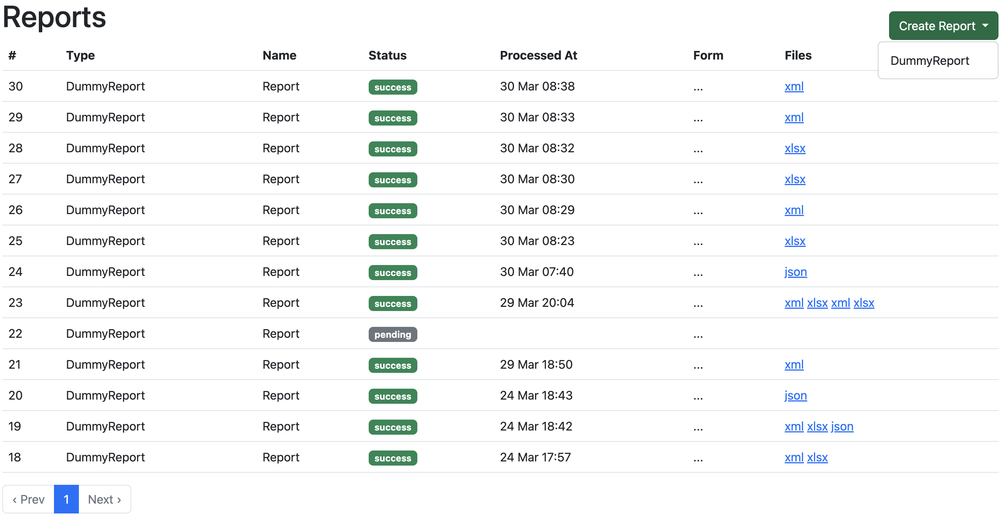

# Reporter
An easy way to generate reports in different formats. See [example project](https://github.com/Nitr/reporter_example)



## Usage
### Define your report class
```ruby
class UserOrdersReport < Reporter::Report
    # define builder for csv
    builder :csv do |report|
        data = report.data

        csv = CSV.new(StringIO.new)
        csv << data.columns
        data.rows.each do |row|
            css << row
        end
        csv.to_io
    end

    # define builder for xlsx
    builder :xlsx do |report|
        data = report.data

        p = Axlsx::Package.new
        wb = p.workbook
        wb.add_worksheet(name: 'Basic Worksheet') do |sheet|
            sheet.add_row(data.columns)
            data.rows.each do |row|
                sheet.add_row(row)
            end
        end
        p.to_stream
    end

    # define method which is called in the builders above.
    # The name of the method can be any as well as the logic and theirs amount.
    # Implementation is all up to you.
    def data
        query = <<-SQL)
            SELECT users.id SUM(orders.amount) AS amount
            FROM users LEFT JOIN orders ON users.id = orders.user_id
            WHERE created_at >= :start AND created_at <= :end
            GROUP BY users.id
        SQL

        connection.execute(
            sanitize_sql_for_assignment([query, start: form_object.start, end: form_object.end])
        )
    end
end
```

### Define builder class
```ruby
    class UserOrdersXmlBuilder
        def call(report)
            data = report.data
            io = StringIO.new
            io.write(data.to_xml)
            io
        end
    end

    class UserOrdersReport < Reporter::Report
        builder :xml, builder_class: UserOrderXmlBuilder

        def data
            ...
        end
    end
```
### Define custom form
```ruby
    # form object
    class UserOrderForm < Reporter::TimeRangeForm
        attribute :user_id, :integer

        validate :user_id, presence: true
    end

    class UserOrdersReport < Reporter::Report
        set_form_class UserOrdersForm
    end
```
```erb
    # app/views/forms
    <%= report_form(report) do |form| %>
        ...
        <%= form.fields_for :form, report.form_object do |f|%>
            <%= f.select :user_id, User.pluck(:id, :name) %>
        <% end %>
        ...
        <%= form.submit class: 'btn btn-primary' %>
    <% end %>
```
### Override default form
By default are using Reporter::BaseForm
If you want to override it for scope of you reports you need this:
```ruby
    class UserReportBase < Reporter::Report
        default_form_class = UserBaseForm
    end

    class UserOrdersReport < UserReportBase
        # define builders and etc
    end
```

## Installation
Add this line to your application's Gemfile:

```ruby
gem "reporter"
```

And then execute:
```bash
$ bundle
```

Or install it yourself as:
```bash
$ gem install reporter
```

Mount routes:
```ruby
    # config/routes.rb

    mount Reporter::Engine => "/reporter"
```

## License
The gem is available as open source under the terms of the [MIT License](https://opensource.org/licenses/MIT).
